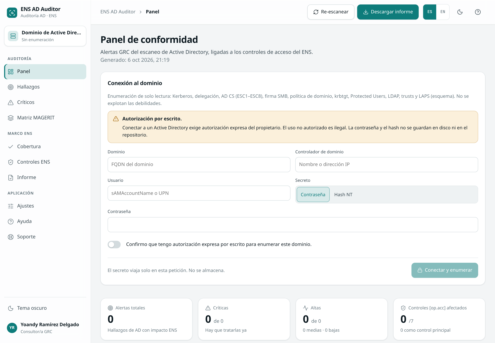
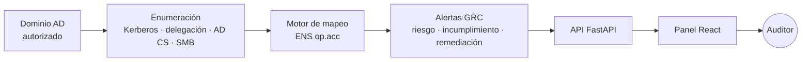
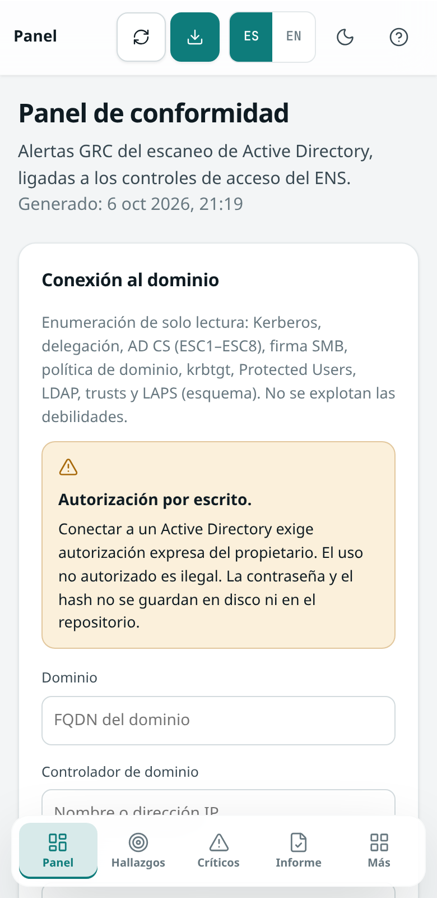
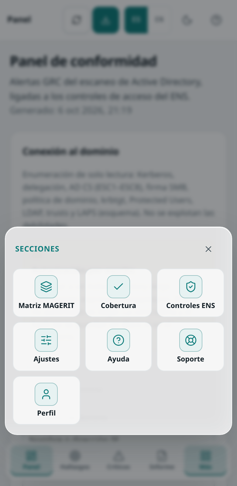

<p align="center">
  <b><i>Enumera un Active Directory autorizado y convierte cada debilidad en una alerta GRC ligada a los controles de acceso del ENS.</i></b>
</p>

<p align="center">
  <a href="LICENSE"></a>
  
  
  
  
</p>

<p align="center">
  
</p>

> Proyecto del Máster en Ciberseguridad y IA (Evolve Academy) · Septiembre de 2026

**ENS AD Auditor** revisa la configuración de un dominio de Active Directory (Kerberos, delegación, AD CS y firma SMB) y traduce cada hallazgo a un incumplimiento de los controles de acceso del Esquema Nacional de Seguridad, familia **`[op.acc]`**, con nivel de riesgo, descripción y remediación.

La regla del proyecto es sencilla: **ningún dato inventado**. Sin conexión a un dominio autorizado no hay alertas: `GET /api/scan` devuelve una lista vacía e `is_sample: false`.

---

## Índice

- [Cómo funciona](#cómo-funciona)
- [Arquitectura](#arquitectura)
- [Qué incluye](#qué-incluye)
- [Capturas](#capturas)
- [Arranque rápido](#arranque-rápido)
- [Aviso](#aviso)
- [Limitaciones conocidas](#limitaciones-conocidas)
- [Estructura](#estructura)
- [Licencia](#licencia)
- [Autor](#autor)

---

## Cómo funciona

1. **Se enumeran cuatro superficies**, contra un dominio autorizado. Kerberos (cuentas con SPN y sin preautenticación), delegación (no restringida, restringida y RBCD), AD CS (ESC1–ESC8) y firma de mensajes SMB.
2. **El motor de mapeo decide el control.** Cada tipo de hallazgo pasa a uno o varios controles `[op.acc]`, con un control principal, un nivel de riesgo (Crítico, Alto, Medio o Bajo) y la remediación.
3. **El panel lo muestra como trabajo de auditoría.** KPIs, filtros por severidad y por control, detalle técnico y descarga del informe en Markdown o JSON.

En vez de decir solo «SMB signing deshabilitado», la alerta dice, por ejemplo, riesgo Alto e incumplimiento del mecanismo de autenticación `[op.acc.5]`, con qué falla y cómo remediarlo.

## Arquitectura



| Pieza | Qué hace | Puerto |
|---|---|---|
| `backend` | API FastAPI, mapeo ENS e informe | `8000` |
| `frontend` | Panel React + TypeScript (Vite) | `5173` |

La enumeración en vivo usa `ldap3` (LDAP), `impacket` (firma SMB) y `certipy-ad` (`find`, solo lectura). Las credenciales se envían en `POST /api/audit` y no se escriben en disco ni en el repositorio.

### Motor de mapeo

`backend/app/mapping/ens_mapping.py` traduce cada tipo de hallazgo a los controles que le tocan. Está cubierto con `pytest`.

| Hallazgo técnico | Control ENS principal |
|---|---|
| Firma SMB deshabilitada | `op.acc.5` / `op.acc.7` |
| Kerberoasting (SPN con RC4) | `op.acc.5` |
| AS-REP roasting (sin preautenticación) | `op.acc.5` / `op.acc.6` |
| Delegación no restringida, restringida o RBCD | `op.acc.4` |
| Privilegios excesivos | `op.acc.2` / `op.acc.4` |
| AD CS ESC1–ESC8 | `op.acc.5` / `op.acc.4` |

Controles de referencia: `op.acc.1` identificación · `op.acc.2` requisitos de acceso · `op.acc.3` segregación de funciones · `op.acc.4` gestión de derechos · `op.acc.5` mecanismo de autenticación · `op.acc.6` acceso local · `op.acc.7` acceso remoto. Marco: Real Decreto 311/2022. Las técnicas de AD CS siguen la clasificación ESC1–ESC8 de SpecterOps.

## Qué incluye

| Sección | Qué resuelve |
|---|---|
| **Conexión** | Dominio, DC, usuario y contraseña o hash NT. Exige confirmar autorización por escrito. El secreto no se guarda. |
| **Panel** | Alertas totales, críticas, altas y controles `[op.acc]` afectados. |
| **Hallazgos** | Lista por riesgo, con evidencia, incumplimiento y remediación. |
| **Controles ENS** | Los siete `op.acc`, cuántas alertas toca cada uno y cuál es el principal. |
| **Informe** | Markdown y JSON para el informe de auditoría. Los textos del informe salen en español. |
| **Ajustes** | Tema claro y oscuro, acento, idioma ES/EN, densidad y reducción de movimiento. |
| **Ayuda** | Flujo, glosario y preguntas frecuentes. |
| **Soporte y perfil** | Formulario local (no se envía a ningún sitio) y ficha del auditor. |
| **Arranque** | Vídeo de intro de 10 segundos. Con movimiento reducido, un splash estático. |
| **Móvil** | Por debajo de 900 px, barra inferior y hoja «Más». Sin menú lateral. |

Las preferencias se guardan en el `localStorage` de este navegador. No se envían al backend.

## Capturas

<p align="center">
  
  <br/><sub><b>Panel</b> · conformidad, severidad y hallazgos. La captura es de una versión anterior del interfaz; esta versión no muestra hallazgos sin enumerar un dominio autorizado.</sub>
</p>

<p align="center">
  
  &nbsp;&nbsp;
  
  <br/><sub><b>Vista móvil</b> · barra inferior y hoja Más</sub>
</p>

## Arranque rápido

**Requisitos:** Python 3.11 o superior, Node.js 20 o superior y npm.

```bash
git clone https://github.com/heindall92/ens_ad-auditor.git
cd ens_ad-auditor
```

```bash
# Backend
cd backend
python3 -m venv .venv && source .venv/bin/activate
pip install -r requirements.txt
uvicorn app.main:app --reload --port 8000
```

```bash
# Frontend, en otra terminal
cd frontend
npm install
npm run dev
```

El panel queda en `http://localhost:5173` y hace de proxy de `/api` hacia `http://127.0.0.1:8000`.

| Servicio | Dirección |
|---|---|
| Panel | `http://localhost:5173` |
| API (vacío, sin credenciales) | `GET http://127.0.0.1:8000/api/scan` |
| Auditoría en vivo | `POST http://127.0.0.1:8000/api/audit` |
| Informe | `GET` o `POST http://127.0.0.1:8000/api/report` |

Otros endpoints: `GET|POST /api/report.json` · `GET /api/controls` · `GET /api/mapping` · `GET /api/health`.

El cuerpo de `POST /api/audit` es JSON: `domain`, `dc_host`, `username`, `password` o `nthash`, y `authorized: true`. Sin `authorized` la API rechaza la petición. El secreto no se registra.

## Aviso

Solo para auditorías y pentests autorizados. Enumerar un Active Directory exige autorización expresa por escrito del propietario. El uso no autorizado es ilegal.

La enumeración es de solo lectura: Kerberos (cuentas con SPN y sin preautenticación), delegación, plantillas AD CS ESC1–ESC8 y firma SMB. No incluye explotación, relay ni solicitud de tickets.

## Limitaciones conocidas

- **Sin credenciales, sin hallazgos.** `GET /api/scan` y `GET /api/report` no inventan datos: lista vacía e `is_sample: false`.
- **Credenciales en la petición.** Dominio, DC, usuario y contraseña o hash NT se envían a `POST /api/audit`. No se guardan en disco, en `localStorage` ni en el repositorio.
- **Alcance de la enumeración.** LDAP (Kerberos y delegación), Certipy `find` (AD CS, sin pedir certificados) e Impacket (firma SMB en el DC y hasta 48 equipos con `dNSHostName`). Un dominio grande puede dejar equipos sin comprobar en SMB.
- **Informe en español.** El selector ES/EN cambia la interfaz. Los textos de las alertas y del informe los genera el backend en español, el idioma del ENS.
- **Sin dominio de prueba en este repositorio.** No hay cifras de un escaneo real porque no se ha auditado ningún dominio desde aquí.

## Estructura

```
ens_ad-auditor/
│
├── frontend/src/                 Panel React + TypeScript + Vite
│   ├── components/               Barra, hallazgos, splash, navegación móvil
│   ├── pages/                    Ajustes, Ayuda, Soporte, Perfil
│   ├── settings/                 Tema, acento, idioma (ES/EN)
│   └── api/                      Cliente de la API
│
├── backend/app/                  API FastAPI
│   ├── main.py                   Endpoints (scan vacío, audit en vivo)
│   ├── enumeration/              Kerberos, delegación, AD CS, SMB (ldap3, impacket, certipy-ad)
│   ├── mapping/ens_mapping.py    Motor ENS [op.acc]
│   └── report.py                 Informe Markdown y JSON
│
├── backend/tests/                Pruebas del mapeo
├── docs/img/readme/              Capturas de este README
├── frontend/public/intro.mp4     Intro de arranque (10 s)
└── LICENSE                       GPLv2
```

## Licencia

Distribuido bajo licencia [GPLv2](LICENSE) · © 2026 Yoandy Ramírez Delgado.

Componentes de terceros: FastAPI (MIT), React (MIT), Vite (MIT). Iconografía de la consola: [Lucide](https://lucide.dev) (ISC).

## Autor

<table>
<tr>
<td align="center" valign="top">
<br/>
<b>Yoandy Ramírez Delgado</b><br/>
<sub>Creador y mantenedor · Junior Pentester · eJPTv2 · Máster en Ciberseguridad y IA (Evolve Academy)</sub><br/>
<a href="https://www.linkedin.com/in/yoandyrd92/">LinkedIn</a> · <a href="https://github.com/heindall92">GitHub</a> · <a href="https://yoandyramirez.com">Portafolio</a> · <a href="https://profile.hackthebox.com/profile/019c5812-b4ca-7315-b12f-14db6d2b42fa">HackTheBox</a>
</td>
</tr>
</table>

¿Encontraste un problema? Abre una *issue* o escribe a <a href="mailto:yoandyramirezdelgado@gmail.com">yoandyramirezdelgado@gmail.com</a>.


